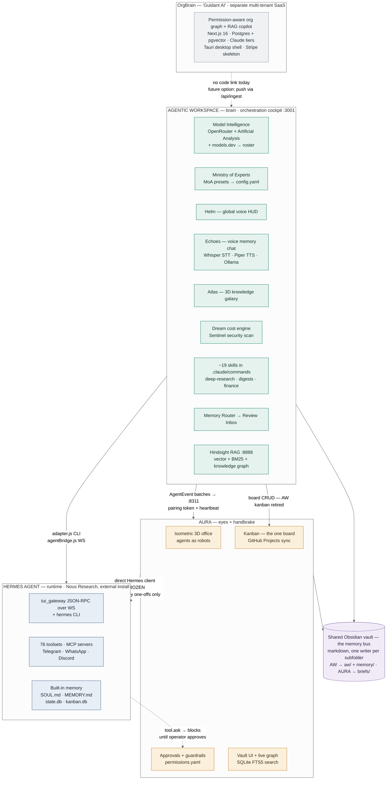
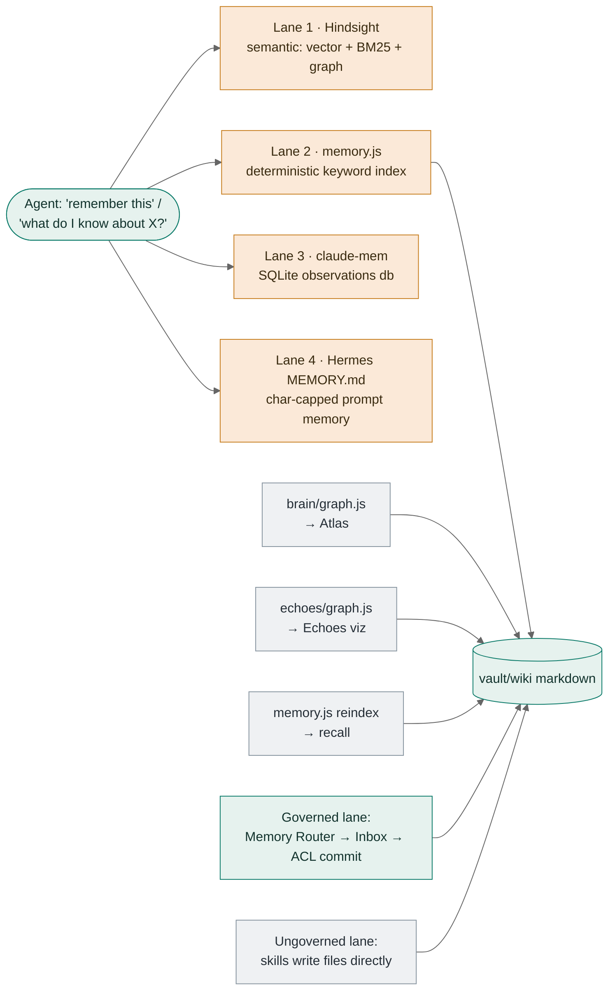

# GuideOps Platform Architecture Map

Audited 2026-07-19 · repos: `agentic-workspace` @1e6cff3 · `orgbrain` @d05461a · `aura` (working tree).
Companion to [`aw-integration-plan.md`](./aw-integration-plan.md). Planned-vs-built is distinguished throughout.

## System map

Three layers with strict roles, plus OrgBrain as a deliberately separate product.
Dashed edges are frozen or future; everything else is built.

Contract: the zod `AgentEvent` schema in `@aura/core`. Transport: plain HTTP + WS, daemon-to-daemon.
MCP was deliberately rejected as the sync transport (token cost); a 3–4-tool read surface is optional step E.

## RAG census — two true embedding RAGs

| # | System | Project | Kind | Stack | Status |
|---|---|---|---|---|---|
| 1 | **Hindsight** | Agentic Workspace | Embedding RAG | Local embeddings + BM25 + knowledge graph, Ollama llama3.1:8b synthesis, self-hosted :8888, zero egress | Built |
| 2 | **Copilot retrieval** | OrgBrain | Embedding RAG (hybrid) | MiniLM-L6-v2 local (or Voyage 3.5-lite) → pgvector + tsvector, RRF fusion, ACL enforced in SQL; Voyage reranker built but off (eval: recall already 1.0) | Built, wired |
| 3 | memory.js vault recall | Agentic Workspace | Lexical, deliberate | Deterministic keyword scoring over `vault/wiki` via `_master-index.md` — no embeddings by decision | Built |
| 4 | Vault search | AURA | Lexical | SQLite FTS5 derived index over the markdown vault | Built |
| 5 | state.db message search | Hermes (inherited) | Lexical | SQLite FTS over session transcripts — ships with Hermes | Inherited |
| 6 | `/rag-pipeline` skill + `domains/ai-ml/rag` | Agentic Workspace | Planned | Listed in ARCHITECTURE.md; no command file, `query-log.json` empty | **Not built** |

Two RAGs is the right number — they serve different products (personal agent memory vs. permission-scoped org retrieval).
Do not add a third in AURA: FTS5 is the correct tool for a vault UI.

## Memory audit — Agentic Workspace has duplicate memory systems

Eleven persistence systems; four answer the identical "remember a durable fact / recall it later" job
with incompatible stores, so a fact retained in one lane is invisible to the other three.

| # | System | Storage | Overlap verdict |
|---|---|---|---|
| 1 | Obsidian vault (`wiki/` + `raw/`) | Markdown, Syncthing-synced | Canonical corpus |
| 2 | memory.js index (`_master-index.md`) | Derived markdown index | **Recall lane 2 of 4** |
| 3 | Hermes built-in memory (`MEMORY.md`/`USER.md`/`SOUL.md`) | Char-capped markdown | **Recall lane 4 of 4** |
| 4 | Hermes `state.db` | SQLite + FTS | Distinct: transcripts |
| 5 | Hermes `kanban.db` | SQLite | **Third board** (AW's retired, AURA's canonical) |
| 6 | Hindsight | Self-hosted :8888 | **Recall lane 1 of 4** · integrated twice (direct + provider catalog) |
| 7 | claude-mem | SQLite `~/.claude-mem` | **Recall lane 3 of 4** (read into Atlas) |
| 8 | Memory Router + Review Inbox | JSON store | Governance — keep as sole write lane |
| 9 | Echoes graph snapshot | JSON | **Vault walker 2 of 3** |
| 10 | Mission store | JSON | Distinct: durable goals |
| 11 | Pluggable providers (Mem0, Honcho, Supermemory…) | External, one active | Overlaps Hindsight conceptually |

**Duplication summary:** 4 incompatible durable-fact lanes · 3 independent vault-graph parsers ·
2 vault write lanes (Router-governed vs. direct skill writes) · Hindsight wired twice · 3 kanban boards, AURA's the survivor.

## OrgBrain scope check

Remarkably little drift: the code delivers what the docs claim — a multi-tenant permission-aware org graph
whose RAG enforces ACLs *inside* the retrieval SQL, with a `canSee` re-check, per-query audit traces, and a
lexical fallback. "Agents" are modeled graph entities, not a runtime; the only agentic behavior is Haiku
document→entity auto-linking. Zero coupling to Hermes/AW/Obsidian/MCP, by documented choice. The clean future
link is push-based: AW → OrgBrain `/api/ingest` with a persona-scoped API key.
Known debts: no ANN index on pgvector (brute-force scan) and the Stripe billing skeleton.

## Recommendations

1. **Collapse four recall lanes to two** — keep Hindsight (semantic) + memory.js (deterministic, benchmarked); demote claude-mem to its read-only Atlas feed; treat Hermes `MEMORY.md` as prompt cache, not a store of record.
2. **Pick one Hindsight integration path** — direct HTTP is the safer keep; it survives Hermes upgrades.
3. **One vault-graph parser** — Atlas, Echoes, and memory.js reimplement the same wikilink scan and will drift.
4. **Close the ungoverned vault write lane** — route skill writes through Router → Inbox → ACL.
5. **Finish the board consolidation** — retiring AW's board strands Hermes `kanban.db`; mirror or ignore it deliberately.
